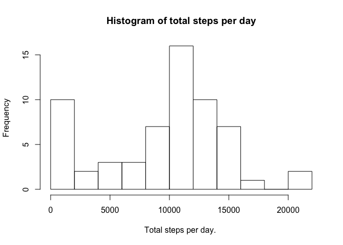
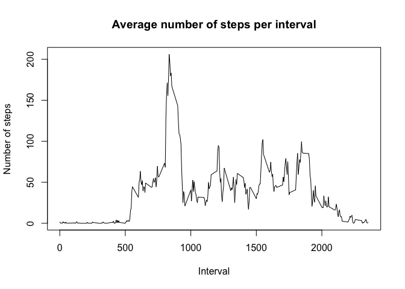
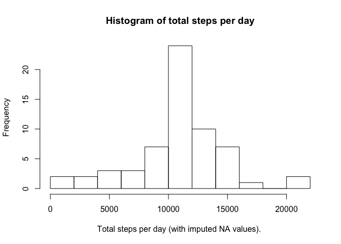
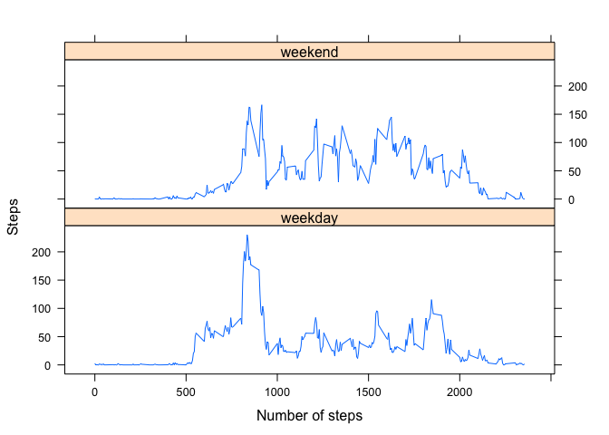

# Reproducible Research: Peer Assessment 1
Erik Konijnenburg  


## Loading and preprocessing the data

First we download the zipfile from the website if it does not exist on the disk. Then we unzip the file. Then we read in the csvDataFile. As a last step we convert the *date* column to a Date type.

```r
zipfile<-"./activity.zip"
url<-"https://d396qusza40orc.cloudfront.net/repdata%2Fdata%2Factivity.zip"
if(!file.exists(zipfile)) {
    download.file(url, zipfile, method="libcurl")
}

unzip(zipfile)
csvDataFile<-"./activity.csv"
activity<-read.csv(csvDataFile, header = TRUE, sep=",")

library(lubridate)
```

```
## 
## Attaching package: 'lubridate'
```

```
## The following object is masked from 'package:base':
## 
##     date
```

```r
activity$date<-ymd(activity$date)
```

## What is mean total number of steps taken per day?
Next the total number of steps per day is determined. From this result the mean and median number of steps is calculated.


```r
library(dplyr)
```

```
## 
## Attaching package: 'dplyr'
```

```
## The following objects are masked from 'package:lubridate':
## 
##     intersect, setdiff, union
```

```
## The following objects are masked from 'package:stats':
## 
##     filter, lag
```

```
## The following objects are masked from 'package:base':
## 
##     intersect, setdiff, setequal, union
```

```r
stepsPerDay <- activity %>%
               group_by(date) %>% 
               summarize(totalsteps = sum(steps, na.rm=TRUE))


hist(x=stepsPerDay$totalsteps, breaks = 10, xlab="Total steps per day. ", 
        main = "Historgram of total steps per day")
```

<!-- -->

```r
meanStepsPerDay <- mean(stepsPerDay$totalsteps)
meanStepsPerDay
```

```
## [1] 9354.23
```

```r
medianStepsPerDay <- median(stepsPerDay$totalsteps)
medianStepsPerDay
```

```
## [1] 10395
```

## What is the average daily activity pattern?

To determine the average number of steps per interval the data is grouped  by interval and  the mean of all steps in each group is taken. 


```r
stepsPerInterval <- activity %>%
               group_by(interval) %>% 
               summarize(averageSteps = mean(steps, na.rm=TRUE))

plot(stepsPerInterval$interval,stepsPerInterval$averageSteps,type="l", 
            xlab="Interval", ylab="Number of steps", main="Average number of steps per interval")
```

<!-- -->

Next the interval with the maximum number of steps is determined

```r
maxIndex <- stepsPerInterval$averageSteps==max(stepsPerInterval$averageSteps)
stepsPerInterval[maxIndex,]$interval
```

```
## [1] 835
```


## Imputing missing values
The initial dataset contains NA values. Let's calculate the amount

```r
naIndex <- is.na(activity$steps)
sum(naIndex)
```

```
## [1] 2304
```

For imputing the missing values a simple strategy is choosen. The strategy is to take the average step value of that interval (averaged over all days)


```r
funcImputeValue <- function(x) {
    stepsPerInterval[stepsPerInterval["interval"] == x,]$averageSteps
}

imputedActivities <- activity %>% 
    mutate(steps = ifelse(
        is.na(steps), funcImputeValue(interval), steps))

stepsPerDayWithImpute <- imputedActivities %>%
               group_by(date) %>% 
               summarize(totalsteps = sum(steps))


hist(x=stepsPerDayWithImpute$totalsteps, breaks = 10, xlab="Total steps per day (with imputed NA values). ", 
        main = "Histogram of total steps per day")
```

<!-- -->

```r
meanStepsPerDayImputed <- mean(stepsPerDayWithImpute$totalsteps)
meanStepsPerDayImputed
```

```
## [1] 10766.19
```

```r
medianStepsPerDayImputed <- median(stepsPerDayWithImpute$totalsteps)
medianStepsPerDayImputed
```

```
## [1] 10766.19
```

By imputing values the both median and mean values change compared to the initial calculation of these values without imputing missing values. Imputing results in a median that is closer to the average.

## Are there differences in activity patterns between weekdays and weekends?

First a weekend/weekday label is assigned to the imputed dataset. Then the average of the steps per interval is calculated.


```r
imputedActivities <- imputedActivities %>%
        mutate(weekday=
                as.factor(ifelse(weekdays(date) == "Saturday" | weekdays(date) == "Sunday", 
                "weekend", "weekday" ) ))

stepsPerIntervalWithWeekday <- imputedActivities %>%
               group_by(interval, weekday) %>% 
               summarize(meanstep = mean(steps))
```


```r
library(lattice)
xyplot(meanstep ~ interval | factor(weekday), data=stepsPerIntervalWithWeekday, type="l", layout=c(1,2), xlab = "Number of steps")
```

<!-- -->

